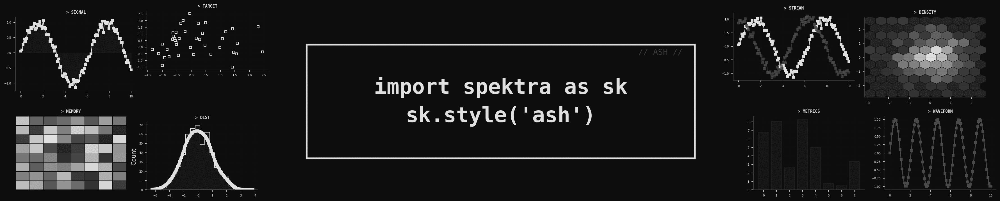
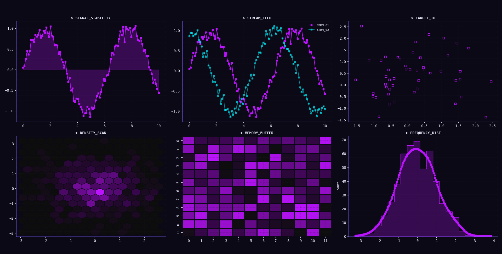
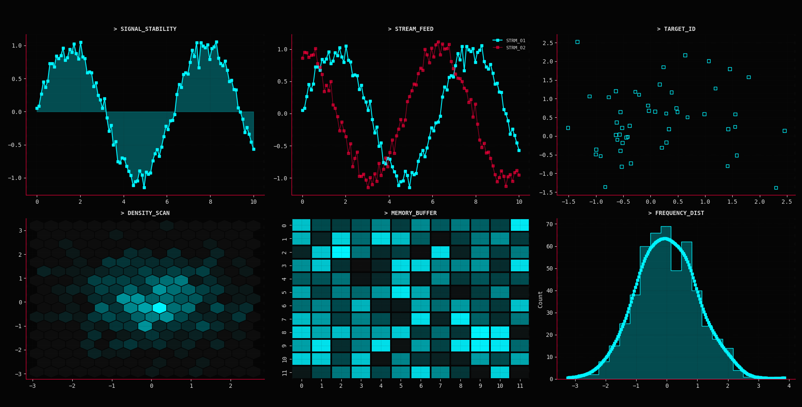
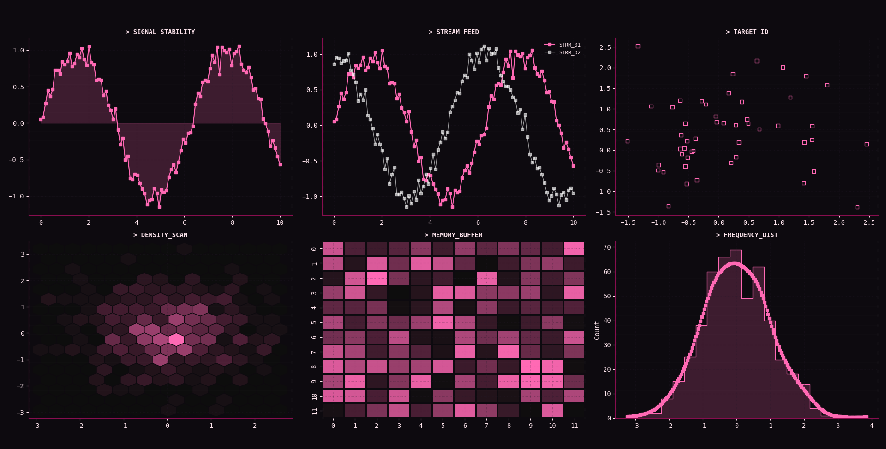
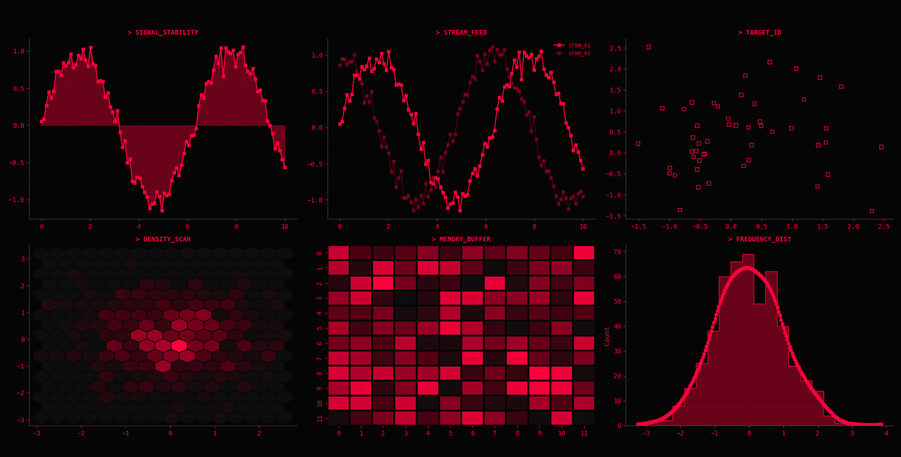
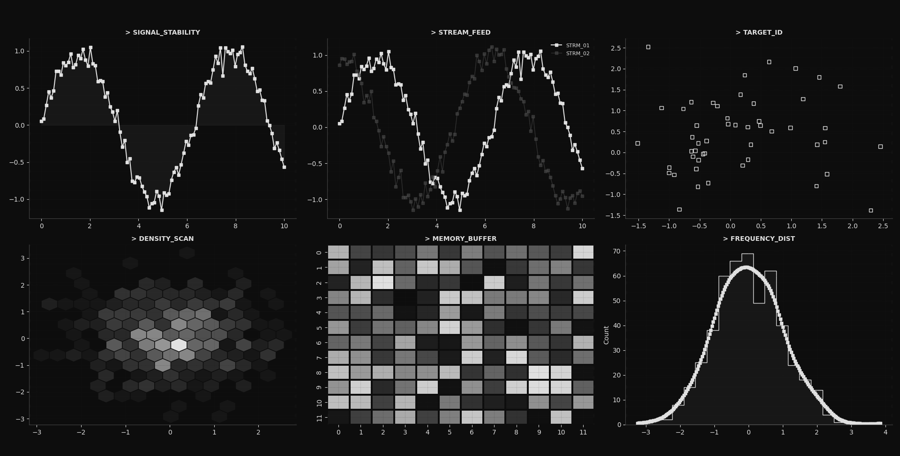

<div align="center">
<p><i>Styles for Matplotlib, Seaborn and Plotly.</i></p>
</div>

<div align="center">
<a href="/examples">Examples</a>
</div>
<hr>


## Quickstart

```bash
pip install spektra
# OR
uv add spektra
```

Then import and apply the styles:

```python
import spektra as sk
import matplotlib.pyplot as plt

# One of ['ember', 'neon', 'ash', 'raiden', 'sakura']
sk.style('ember')  # <- This applies styles to matplotlib, seaborn and plotly~
```

## Usage

```python
import spektra as sk
import matplotlib.pyplot as plt

# One of ['ember', 'neon', 'ash', 'raiden', 'sakura']
sk.style('ember')  

plt.plot([1, 2, 3], [1, 4, 9])
plt.show()
```

A few themes are available:

```python
print(sk.get_available_themes())
# ['sakura', 'neon', 'ash', 'raiden', 'ember']
```

<table border="0">
   <tr>
      <td>
         
      </td>
      <td align="center">Raiden</td>
   </tr>
   <tr>
      <td>
         
      </td>
      <td align="center">Neon</td>
   </tr>
   <tr>
      <td>
         
      </td>
      <td align="center">Sakura</td>
   </tr>
   <tr>
      <td>
         
      </td>
      <td align="center">Ember</td>
   </tr>
   <tr>
      <td></td>
      <td align="center">Ash</td>
   </tr>
</table>

Quickview:

```python
print(sk.get_available_themes())
# ['sakura', 'neon', 'ash', 'raiden', 'ember']

print(sk.get_theme())
# ember

print(sk.get_cmap())
# <matplotlib.colors.LinearSegmentedColormap object at 0x10d6ae750>

print(sk.get_palette(n=5))
# ['#FF003C', '#FF00FF', '#00F3FF', '#FFEA00', '#00FF41']

# Config as dict
print(sk.get_config())
#{'name': 'ember', 'colors': {'bg': '#050505', 'accent': '#FF003C', 'secondary': '#9D0025', 'text': '#FF003C', 'grid': '#1A0006'},
# 'palette': ['#FF003C', '#FF00FF', '#00F3FF', '#FFEA00', '#00FF41', '#FF9500'], 'settings': {'alpha': 0.4, 'op': 0.4, 'font': 
# 'monospace'}, 'matplotlib': {'figure.facecolor': '#050505', 'axes.facecolor': '#050505', 'axes.edgecolor': '#444444', 'axes.
# labelcolor': '#FF003C', 'axes.titlesize': 10, 'axes.titleweight': 'bold', 'grid.color': '#1A0006', 'grid.alpha': 0.3, 'grid.
# linestyle': ':', 'xtick.color': '#FF003C', 'ytick.color': '#FF003C', 'text.color': '#FF003C', 'font.family': 'monospace', 'axes.
# spines.top': False, 'axes.spines.right': False, 'lines.color': '#FF003C', 'lines.marker': 's', 'lines.markersize': 4, 'patch.
# facecolor': '#FF003C', 'patch.edgecolor': '#050505', 'scatter.marker': 's', 'scatter.edgecolors': '#FF003C'}, 'plotly': 
# {'paper_bgcolor': '#050505', 'plot_bgcolor': '#050505', 'font_color': '#FF003C', 'font_family': 'Roboto Mono, Cascadia Code, 
# Source Code Pro, Courier New, monospace', 'grid_color': '#1A0006', 'axis_line_color': '#444444'}, 'cmap': <matplotlib.colors.
# LinearSegmentedColormap object at 0x1083e7d40>}
```

## Theme Files

All theme files are stored under their respective `spektra/themes/{THEME_NAME}.json` file.
They're stored as JSON for ease of reusability between Maplotlib/Seaborn and Plotly.
`spektra` scans the directory, so adding a `.json` file to it will register a new theme.

## License
[Apache 2.0](LICENSE.md)
